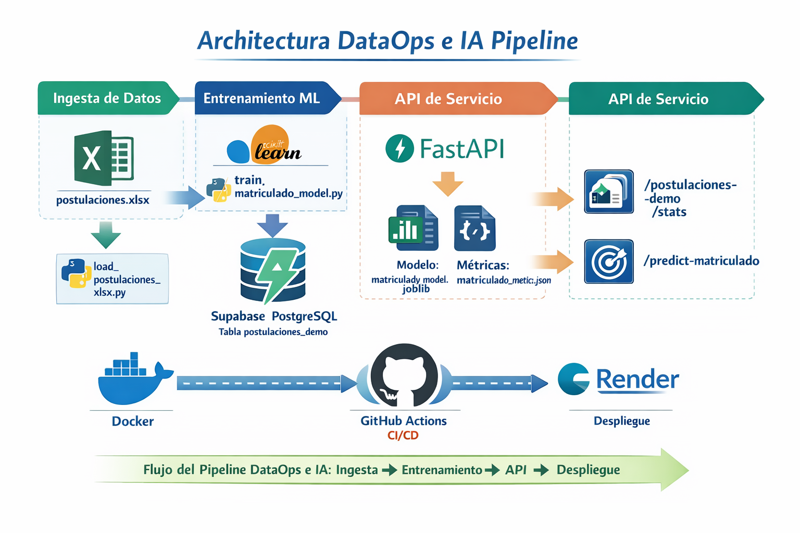

# MVP DataOps Docente

Repositorio piloto para preparar, probar y documentar un entorno técnico reproducible para soluciones de datos e IA.

## Objetivo
Contar con una base técnica simple y replicable para que los grupos de estudiantes puedan trabajar con:
- Python 3
- FastAPI
- Docker
- Git y GitHub
- GitHub Actions
- Render
- Supabase (PostgreSQL)
- Scikit-learn para un clasificador binario simple

## Arquitectura del MVP
La solución implementa una arquitectura IA híbrida simple:

- Aplicación Python dockerizada
- API con FastAPI
- CI/CD con GitHub Actions
- Despliegue en Render
- Base de datos PostgreSQL en Supabase
- Modelo de clasificación binaria con Regresión Logística

## Estructura del proyecto
```text
mvp-dataops-docente/
├─ app/
│  ├─ __init__.py
│  ├─ main.py
│  ├─ db.py
│  └─ predict.py
├─ scripts/
│  ├─ load_postulaciones_xlsx.py
│  └─ train_matriculado_model.py
├─ artifacts/
│  ├─ matriculado_model.joblib
│  └─ matriculado_metrics.json
├─ examples/
│  └─ predict_matriculado_payload.json
├─ tests/
│  └─ test_health.py
├─ data/
│  └─ postulaciones.xlsx
├─ sql/
│  └─ 01_create_postulaciones_demo_table.sql
├─ .github/
│  └─ workflows/
│     └─ ci.yml
├─ .env.example
├─ .gitignore
├─ .dockerignore
├─ Dockerfile
├─ README.md
├─ render.yaml
└─ requirements.txt
```

## Flujo implementado
1. Se dispone de un archivo Excel de ejemplo en `data/postulaciones.xlsx`
2. Se crea una tabla destino en Supabase: `public.postulaciones_demo`
3. Un script Python carga los datos del Excel a Supabase
4. La API consulta esos datos y los expone en JSON
5. Se generan estadísticas básicas del dataset
6. Se entrena un clasificador binario para `MATRICULADO`
7. El modelo queda disponible mediante un endpoint de predicción
8. El proyecto se prueba localmente, con Docker y en la nube

## Dataset y variable objetivo
Se utiliza el dataset de postulaciones y la variable objetivo es:

- `MATRICULADO` → valores `SI` / `NO`

Para el MVP se implementó un clasificador binario con **Regresión Logística**.

## Endpoints actuales
- `GET /` : verifica que la API esté activa
- `GET /health` : verifica salud general
- `GET /db-health` : verifica conexión a Supabase
- `GET /postulaciones-demo?limit=20` : devuelve registros desde la tabla `postulaciones_demo`
- `GET /postulaciones-demo/stats` : devuelve estadísticas básicas del dataset
- `POST /predict-matriculado` : devuelve la predicción de matrícula usando el modelo entrenado

## Ejecución local
1. Clonar el repositorio
2. Crear archivo `.env` a partir de `.env.example`
3. Activar entorno virtual
4. Instalar dependencias
5. Ejecutar:

```bash
python -m uvicorn app.main:app --host 127.0.0.1 --port 8000
```

## Pruebas locales de API
Probar en navegador o herramienta similar:

```text
http://127.0.0.1:8000/
http://127.0.0.1:8000/health
http://127.0.0.1:8000/db-health
http://127.0.0.1:8000/postulaciones-demo?limit=5
http://127.0.0.1:8000/postulaciones-demo/stats
http://127.0.0.1:8000/docs
```

## Carga de datos desde Excel
El script de carga es:

```bash
python scripts/load_postulaciones_xlsx.py
```

### Qué hace
- lee `data/postulaciones.xlsx`
- usa la hoja `Postulaciones`
- valida columnas esperadas
- limpia la tabla `public.postulaciones_demo`
- inserta nuevamente los registros

## SQL base de la tabla
La tabla se crea con el archivo:

```text
sql/01_create_postulaciones_demo_table.sql
```

Ese archivo debe ejecutarse en **Supabase > SQL Editor** antes de correr la carga del Excel.

## Estadísticas del dataset
El endpoint:

```text
GET /postulaciones-demo/stats
```

devuelve:
- total de postulaciones
- promedio de puntaje
- promedio de `ptje_nem`
- promedio de `psu_promlm`
- distribución por sexo
- top 10 regiones
- top 10 carreras

## Entrenamiento del modelo
El script de entrenamiento es:

```bash
python scripts/train_matriculado_model.py
```

### Qué hace
- lee los datos desde `public.postulaciones_demo`
- prepara variables categóricas y numéricas
- usa `ColumnTransformer` + `OneHotEncoder`
- divide train/test con `stratify=y`
- entrena una `LogisticRegression`
- guarda el modelo y las métricas

### Artefactos generados
```text
artifacts/matriculado_model.joblib
artifacts/matriculado_metrics.json
```

## Resultado base del modelo
En la versión actual del MVP se obtuvo aproximadamente:

- `accuracy`: 0.8457

La interpretación general es:
- buen desempeño para identificar la clase `NO`
- desempeño razonable como línea base para identificar `SI`
- suficiente como MVP académico y demostración docente

## Predicción
El endpoint:

```text
POST /predict-matriculado
```

espera un JSON con estas variables:
- `periodo`
- `sexo`
- `preferencia`
- `carrera`
- `facultad`
- `puntaje`
- `grupo_depen`
- `region`
- `latitud`
- `longitud`
- `ptje_nem`
- `psu_promlm`
- `pace`
- `gratuidad`

### Payload de ejemplo
Existe un ejemplo en:

```text
examples/predict_matriculado_payload.json
```

También puedes usar este JSON:

```json
{
  "periodo": 2024,
  "sexo": "F",
  "preferencia": 1,
  "carrera": "INGENIERIA CIVIL INFORMATICA",
  "facultad": "INGENIERIA",
  "puntaje": 780,
  "grupo_depen": "PARTICULAR SUBVENCIONADO",
  "region": "VALPARAISO",
  "latitud": -33.0472,
  "longitud": -71.6127,
  "ptje_nem": 800,
  "psu_promlm": 760,
  "pace": "NO",
  "gratuidad": "SI"
}
```

### Respuesta esperada
```json
{
  "status": "ok",
  "prediction": {
    "predicted_class": 1,
    "predicted_label": "SI",
    "probability_no": 0.23,
    "probability_si": 0.77
  }
}
```

## Docker
Construir imagen:

```bash
docker build -t mvp-dataops-docente .
```

Ejecutar contenedor:

```bash
docker run --name mvp-dataops-docente-container -p 8000:8000 mvp-dataops-docente
```

## CI/CD
El workflow `.github/workflows/ci.yml`:
- instala dependencias
- ejecuta pruebas automáticas
- valida el proyecto en cada push a `main`

## Render
El servicio web se despliega en Render usando Docker y `render.yaml`.

URL pública actual:

```text
https://mvp-dataops-docente.onrender.com
```

Pruebas públicas sugeridas:

```text
https://mvp-dataops-docente.onrender.com/health
https://mvp-dataops-docente.onrender.com/db-health
https://mvp-dataops-docente.onrender.com/postulaciones-demo?limit=5
https://mvp-dataops-docente.onrender.com/postulaciones-demo/stats
https://mvp-dataops-docente.onrender.com/docs
```

## Supabase
La conexión a PostgreSQL se realiza mediante variables de entorno:
- `SUPABASE_DB_HOST`
- `SUPABASE_DB_PORT`
- `SUPABASE_DB_NAME`
- `SUPABASE_DB_USER`
- `SUPABASE_DB_PASSWORD`

## Variables mínimas
Ejemplo base:

```env
APP_ENV=development
PORT=10000

SUPABASE_DB_HOST=
SUPABASE_DB_PORT=5432
SUPABASE_DB_NAME=postgres
SUPABASE_DB_USER=
SUPABASE_DB_PASSWORD=
MODEL_TARGET_COLUMN=
```

## Estado actual del piloto docente
- [x] Repositorio creado y conectado a GitHub
- [x] App mínima en FastAPI
- [x] Docker operativo
- [x] Tests locales funcionando
- [x] GitHub Actions en verde
- [x] Servicio desplegado en Render
- [x] Conexión pública a Supabase verificada
- [x] Tabla `postulaciones_demo` creada en Supabase
- [x] Carga de Excel a Supabase ejecutada
- [x] Endpoint local de lectura funcionando
- [x] Endpoint público de lectura funcionando
- [x] Endpoint local de estadísticas funcionando
- [x] Endpoint público de estadísticas funcionando
- [x] Modelo de regresión logística entrenado
- [x] Endpoint local de predicción funcionando
- [x] Endpoint público de predicción funcionando

## Uso docente sugerido
1. Probar este repositorio piloto de punta a punta
2. Replicar la misma estructura en los repositorios de los grupos
3. Pedir que cada grupo configure sus variables y despliegue su propia versión
4. Evaluar sobre una base técnica comparable

## Checklist mínimo para estudiantes
- repositorio en GitHub
- README claro
- `.env.example`
- `Dockerfile`
- workflow de GitHub Actions
- servicio desplegado en Render
- proyecto Supabase creado
- conexión a base funcionando
- carga de Excel ejecutada
- endpoint de lectura funcionando
- endpoint de estadísticas funcionando
- endpoint de predicción funcionando

## Siguiente etapa sugerida
El MVP ya cuenta con una base funcional para ser reutilizada en contextos docentes y replicada por grupos de estudiantes.
